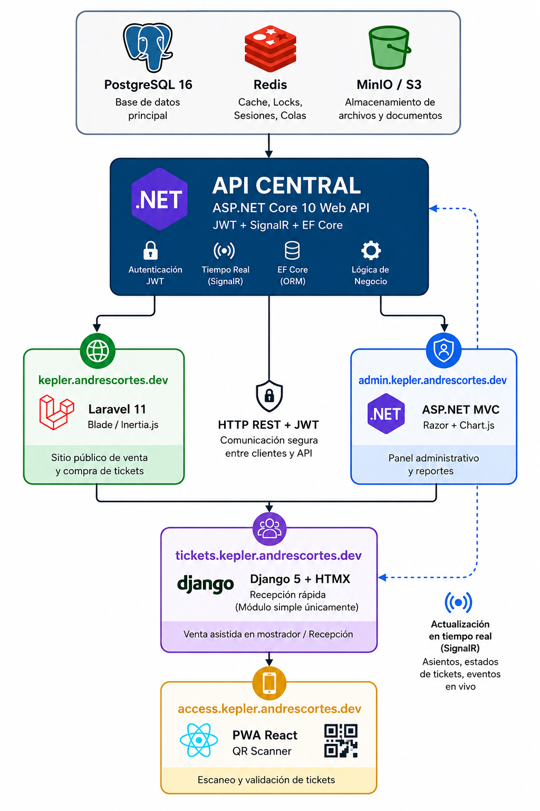

```
                        ┌──────────────────────┐
                        │ PostgreSQL 16        │
                        │ Redis                │
                        │ MinIO / S3           │
                        └─────────┬────────────┘
                                  │
                    ┌─────────────▼─────────────┐
                    │ API CENTRAL               │
                    │ ASP.NET Core 10 Web API  │
                    │ JWT + EF Core  │
                    └───────┬─────────┬─────────┘
                            │         │
        ┌───────────────────┘         └───────────────────┐
        │                                                 │
┌───────▼────────┐                            ┌──────────▼─────────┐
│ tickets.com    │                            │ admin.tickets.com  │
│ Laravel 11     │                            │ ASP.NET MVC        │
│ Blade/Inertia  │                            │ Razor + Chart.js   │
└───────┬────────┘                            └──────────┬─────────┘
        │                                                │
        └────────────────┬───────────────────────────────┘
                         │
               HTTP REST + JWT
                         │
        ┌────────────────▼────────────────┐
        │ tickets.reception.com           │
        │ Django 5 + HTMX                │
        │ Recepción rápida               │
        │ (Módulo simple únicamente)     │
        └────────────────┬───────────────┘
                         │
                         ▼
               ┌────────────────┐
               │ success.app    │
               │ PWA React      │
               │ QR Scanner     │
               └────────────────┘
```




Routes:
- `kepler.andrescortes.dev` -> main app page for user
- `admin.kepler.andrescortes.dev` -> admin page with metrics
- `tickets.kepler.andrescortes.dev` -> page where an employee can sell tickets
- `access.kepler.andrescortes.dev` -> page where tickets are verified
